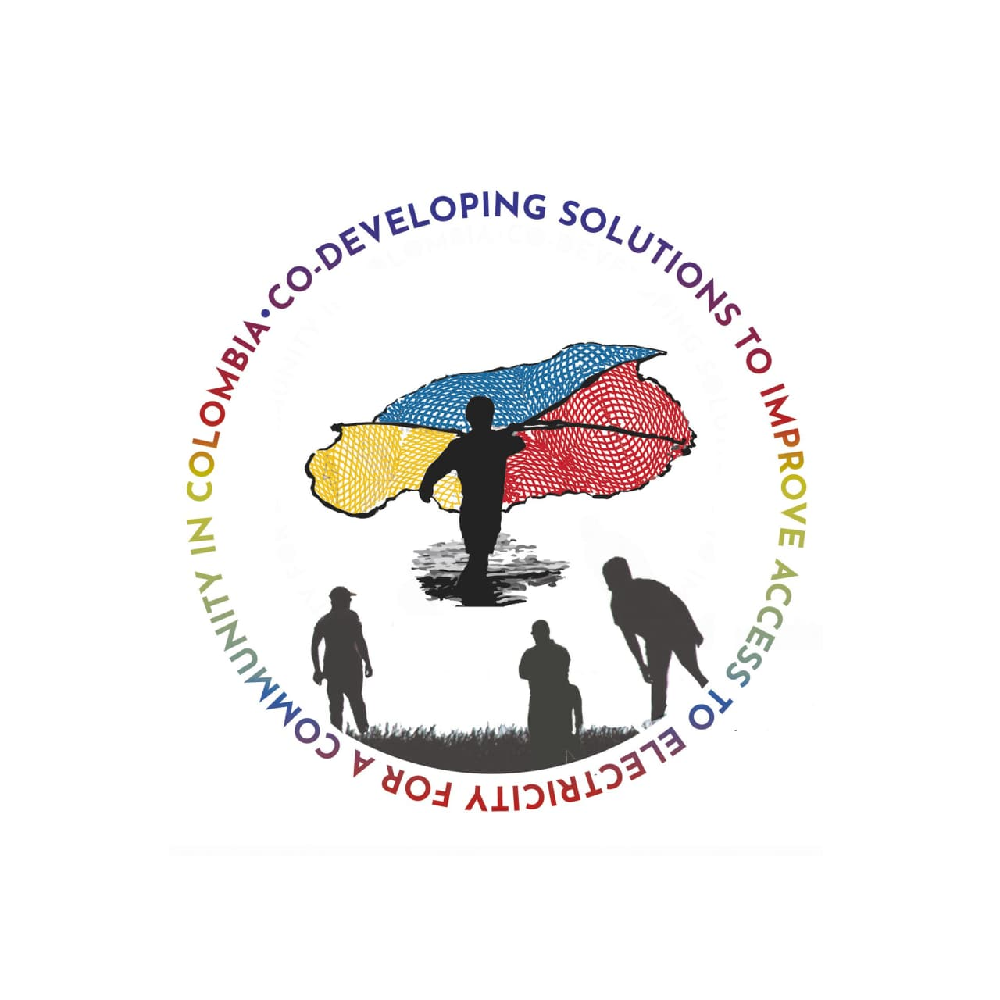

# ¡Bienvenidos al repositorio del laboratorio vivo en Puebloviejo, Colombia!

# Welcome to the repository of the living laboratory in Pueblo Viejo, Colombia!

Repositorio de acceso abierto que incluye literatura relevante, fotos, datos y detalles de contacto.

Open access repository including relevant literature, photos, data and contact details.

<iframe width="560" height="315" src="https://www.youtube.com/embed/gZjg6wSJtIw" title="YouTube video player" frameborder="0" allow="accelerometer; autoplay; clipboard-write; encrypted-media; gyroscope; picture-in-picture" allowfullscreen></iframe>

# Versión en español

### Objetivos

Una encuesta a la población identificó el **acceso a la electricidad y la reducción de la pobreza** como las principales necesidades. 

El objetivo de este proyecto es ahora **establecer un diagnóstico sobre el acceso a la electricidad** y encontrar **soluciones solidarias** junto con la población local que permitan salir de la pobreza energética.
A continuación, se medirán los avances con los métodos adecuados. Se encuestará a los hogares, las empresas y las instituciones públicas sobre el acceso a la electricidad. Se redactará material de comunicación en diferentes idiomas y se celebrarán seminarios o conferencias en línea para concienciar y proponer soluciones. Para lograr un alcance tanto local como global, también se formularán otras investigaciones que se abordarán en el futuro para nuevas colaboraciones en el proyecto. Se prevé una investigación académica y una cooperación práctica a largo plazo entre Colombia y Alemania.

### Co-desarrollar soluciones para mejorar el acceso a la electricidad 

Con el objetivo de mejorar la calidad de vida de una comunidad del norte de Colombia, Puebloviejo, se puso en marcha un proyecto de cooperación binacional. 

Su objetivo es proporcionar un acceso fiable y asequible a la energía eléctrica a través de soluciones sostenibles y basadas en la demanda. 

* liderado por la universidad **Universidad del Magdalena, situada en Santa Marta**, la capital de la provincia de Magdalena, en el norte de Colombia
* en 2019, la Universidad del Magdalena colaboró con el Instituto de Tecnología Energética (IET) de la **TU Berlín** en el **proyecto "Rejuveneciendo Pueblo Viejo"**
* apoyo del startup HEDERA Sustainable Solutions con varias herramientas digitales para el análisis de impacto utilizando el enfoque del Marco Multi-Nivel (MTF) para la medición del acceso a la energía
* [IASS Potsdam](https://www.iass-potsdam.de/en)(Institute for Advanced Sustainability Studies e.V.) contribuye igualmente con su experiencia en materia de acceso a la energía y justicia energética, así como con los laboratorios vivos
* los grupos de trabajo interdisciplinarios han convocado laboratorios vivos de sostenibilidad, cooperación e innovación

# English version

### Objectives

A population survey identified **access to electricity and poverty reduction** as the main needs. 

The aim of this project is now to **stablish a diagnostic on access to electricity** and to find **solidarity-based solutions** together with the local population that will enable a way out of energy poverty.
Progress will then be measured using appropriate methods. Households, businesses, and public institutions will be surveyed about access to electricity. Communication materials will be written in different languages and online seminars or conferences will be held to raise awareness and propose solutions. To achieve both local and global scopes, further research to be addressed in the future will also be formulated for further project collaborations. Long-term academic research and practical cooperation between Colombia and Germany is foreseen.

### Co-developing solutions to improve access to electricity for a community in Colombia

With the goal to improve the quality of life of a community in north Colombia, Pueblo Viejo, a binational cooperation project was launched. 

It aims toward the provision of reliable and affordable access to electric power through demand-driven and sustainable solutions.  

* led by the state-supported university **Universidad del Magdalena located in Santa Marta**, the capital of Magdalena Province in northern Colombia
* In 2019, the Universidad del Magdalena collaborated with the Institute of Energy Technology (IET) at **TU Berlin** in 2019 for the **project "Rejuveneciendo Pueblo Viejo"**
* supported by the startup HEDERA Sustainable Solutions with various digital tools for impact analysis using the Multi-Tier Framework approach for energy access measurement
* [IASS Potsdam](https://www.iass-potsdam.de/en)(Institute for Advanced Sustainability Studies e.V.) likewise contributes content expertise on energy access and energy justice as well as to living laboratories
* Interdisciplinary working groups have convened living laboratories for sustainability, cooperation, and innovation

### How does this repository work? 

If you want to check literature, have a look at the files in our repository.  You can both download the pdf documents and the bibtex citations. If you want to read more about a project, have a look at our wiki.
Our sources are divided into different keywords, such as sources on living laboratories, specific papers on Colombia and Magdalena region and on energy access.

     
     
     
## Contact details

Contact details: natalia@hedera.online (HEDERA, Impact-R-Project)
Repository: nadja.hemming@hedera.online

